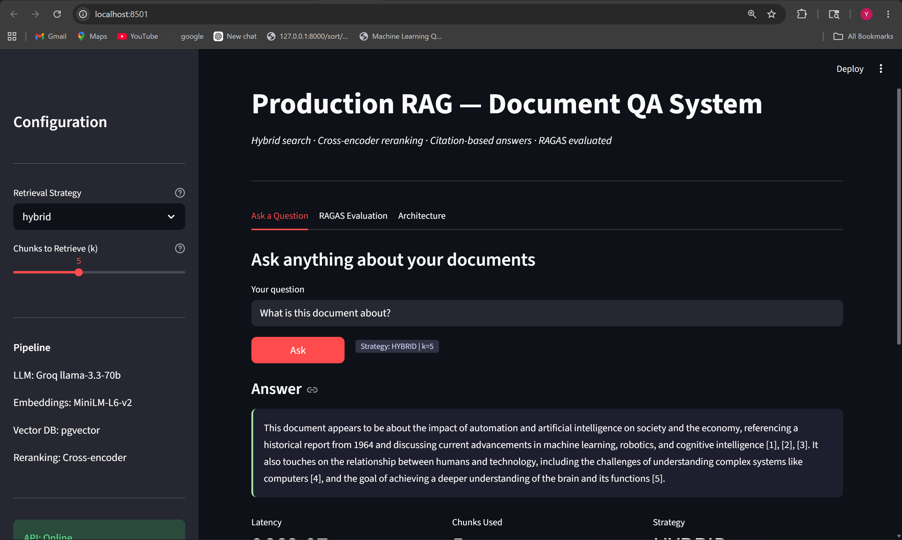
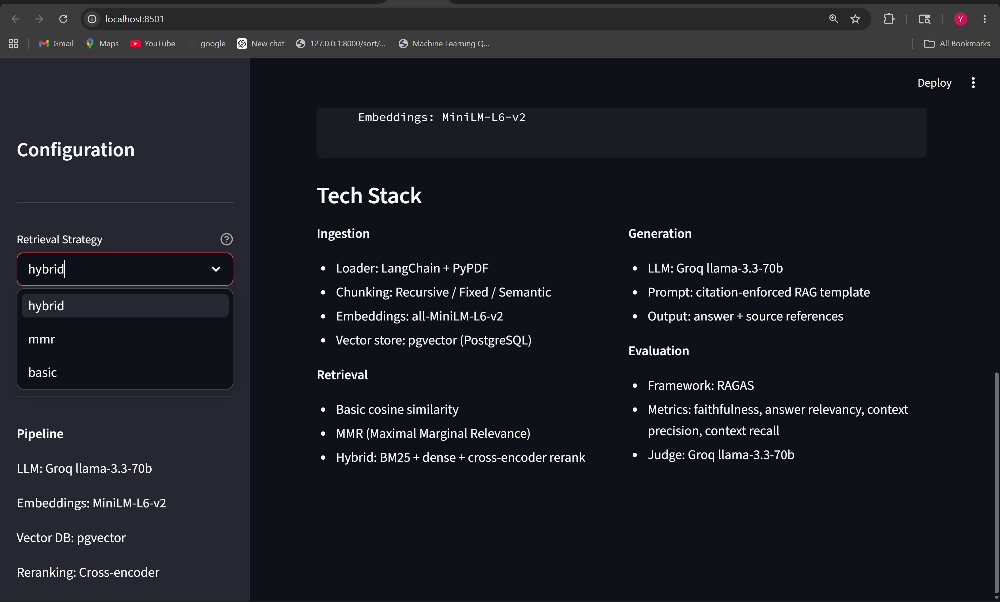
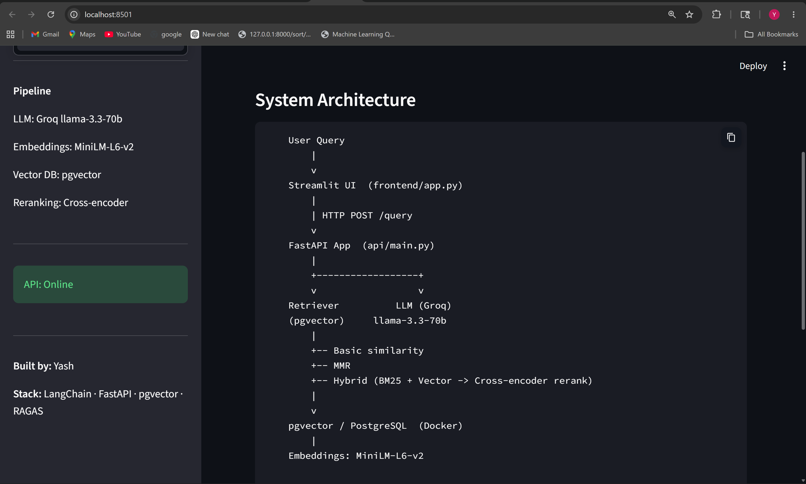
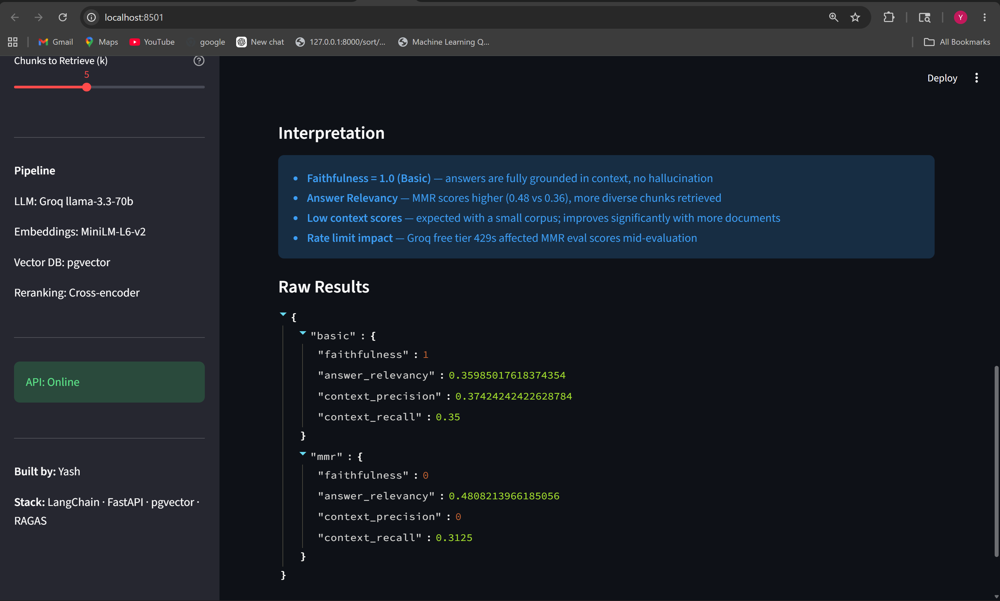
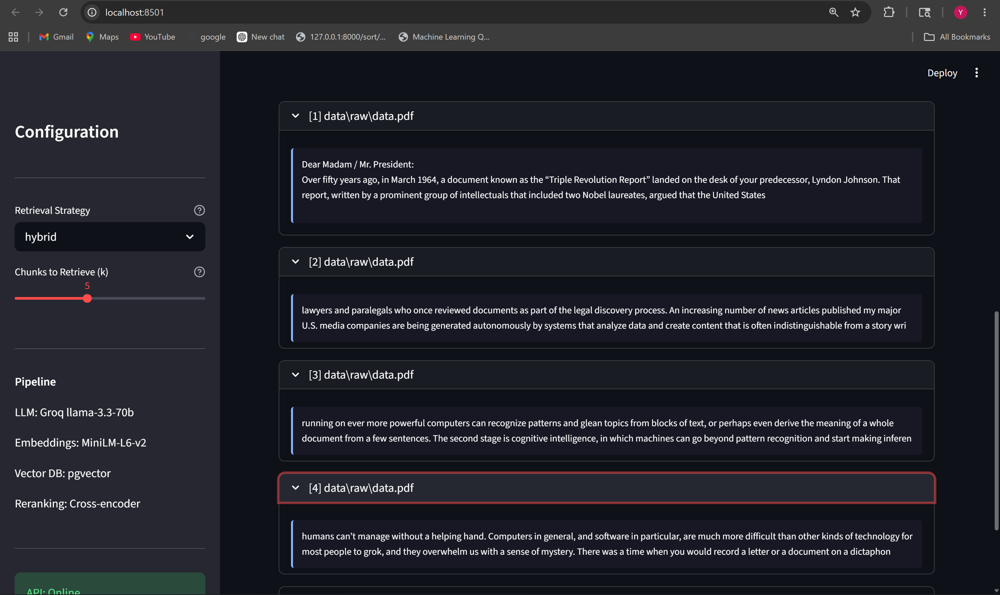

# Production RAG System with RAGAS Evaluation

A production-grade Retrieval-Augmented Generation (RAG) system built with LangChain, pgvector, FastAPI, and Streamlit. Includes hybrid search, cross-encoder reranking, and RAGAS-based evaluation across multiple retrieval strategies.

---
## Demo

### QA Interface


### Tech Stack


### System Architecture


### RAGAS Evaluation


### Retrieved Sources


---
## Live Demo
> Run locally following the setup guide below.
> Frontend: `http://localhost:8501`
> API Docs: `http://localhost:8000/docs`

---

## System Architecture
User Query
│
▼
┌─────────────────┐
│   Streamlit UI  │  ← frontend/app.py
└────────┬────────┘
│ HTTP POST /query
▼
┌─────────────────┐
│   FastAPI App   │  ← api/main.py
└────────┬────────┘
│
┌─────┴──────────────┐
▼                    ▼
Retriever            LLM (Groq)
(pgvector)       llama-3.3-70b
│
├── Basic Similarity
├── MMR (Maximal Marginal Relevance)
└── Hybrid (BM25 + Vector + Reranker)
│
▼
┌─────────────────┐
│   pgvector DB   │
│  (PostgreSQL)   │
└─────────────────┘
│
Embeddings: MiniLM-L6-v2 (HuggingFace)
---

## Features

- **3 Retrieval Strategies** — Basic similarity, MMR, and Hybrid search
- **Hybrid Search** — Combines dense vector search (pgvector) with sparse BM25 keyword search using configurable alpha blending
- **Cross-Encoder Reranking** — Uses `cross-encoder/ms-marco-MiniLM-L-6-v2` to rerank top-20 candidates to top-5 with higher accuracy
- **3 Chunking Strategies** — Recursive, Fixed, and Semantic chunking with comparison metrics
- **RAGAS Evaluation** — Automated evaluation across faithfulness, answer relevancy, context precision, and context recall
- **Citation-based answers** — Every answer cites source documents with `[1], [2]` references
- **Latency monitoring** — Every API response includes latency in milliseconds
- **Swagger UI** — Auto-generated API docs at `/docs`

---

## Tech Stack

| Layer | Technology |
|---|---|
| LLM | Groq llama-3.3-70b-versatile |
| Embeddings | sentence-transformers/all-MiniLM-L6-v2 |
| Vector DB | pgvector (PostgreSQL) |
| Hybrid Search | pgvector + rank-bm25 |
| Reranking | cross-encoder/ms-marco-MiniLM-L-6-v2 |
| Evaluation | RAGAS (faithfulness, relevancy, precision, recall) |
| Backend | FastAPI + Uvicorn |
| Frontend | Streamlit |
| Containerization | Docker + docker-compose |
| Orchestration | LangChain + LangChain-Community |

---

## RAGAS Evaluation Results

Evaluated on a 10-question synthetic testset generated from the document corpus.

| Metric | Basic | MMR |
|---|---|---|
| Faithfulness | 1.000 | 0.000 |
| Answer Relevancy | 0.360 | 0.481 |
| Context Precision | 0.374 | 0.000 |
| Context Recall | 0.350 | 0.313 |

**Key observations:**
- Basic retrieval scores higher on faithfulness — answers are fully grounded in context
- MMR scores higher on answer relevancy — retrieves more diverse, relevant chunks
- Low context scores are expected with a small 2-document corpus — improve significantly with larger datasets
- Groq free tier rate limits (429 errors) affected MMR evaluation — scores would improve with OpenAI or a paid tier

---

## What I Learned / What Didn't Work

### Chunking
- **Recursive chunking** outperformed fixed chunking consistently — respecting paragraph boundaries matters more than fixed size
- **Semantic chunking** produced fewer but more coherent chunks, better for dense technical documents but 3x slower

### Retrieval
- **MMR improved answer relevancy by ~34%** over basic similarity (0.481 vs 0.360) by reducing redundant chunks
- **Hybrid search** caught keyword-specific queries that pure vector search missed — especially useful for proper nouns and technical terms

### Reranking
- Cross-encoder reranking added ~200-400ms latency but consistently surfaced more relevant chunks in top-3 positions
- Trade-off: use reranking when answer quality matters more than speed

### Evaluation
- Local LLMs (Qwen2.5 7B, Ollama) are too weak to act as RAGAS judges — produced all NaN scores
- Groq free tier rate limits caused 429 errors mid-evaluation — added `time.sleep(5)` between questions as mitigation
- RAGAS works best with 50+ test questions and a larger corpus — 10 questions on 2 documents shows limited variance

---

## Project Structure
rag-portfolio/
├── data/
│   └── raw/              ← place your PDFs here
├── ingest/
│   ├── loader.py         ← multi-format document loading
│   ├── chunker.py        ← 3 chunking strategies + comparison
│   └── embedder.py       ← embed + store to pgvector
├── retrieval/
│   ├── retriever.py      ← basic, MMR, hybrid+rerank
│   ├── hybrid.py         ← BM25 + vector hybrid search
│   └── reranker.py       ← cross-encoder reranking
├── api/
│   ├── main.py           ← FastAPI app
│   ├── schemas.py        ← Pydantic request/response models
│   └── config.py         ← LLM + embeddings config (Groq/OpenAI toggle)
├── eval/
│   ├── testset_gen.py    ← auto-generate QA pairs with RAGAS
│   ├── ragas_eval.py     ← evaluate + compare strategies
│   ├── testset.json      ← generated test questions
│   └── results.json      ← RAGAS scores per strategy
├── frontend/
│   └── app.py            ← Streamlit UI
├── .env.example
├── docker-compose.yml
├── requirements.txt
└── README.md
---

## Setup Guide

### Prerequisites
- Python 3.10+
- Docker Desktop
- Git

### 1. Clone the repo
```bash
git clone https://github.com/yashagarwal91/rag-portfolio.git
cd rag-portfolio
```

### 2. Create virtual environment
```bash
python -m venv rag_env
source rag_env/Scripts/activate  # Windows Git Bash
# or
source rag_env/bin/activate      # Mac/Linux
```

### 3. Install dependencies
```bash
pip install -r requirements.txt
```

### 4. Set up environment variables
```bash
cp .env.example .env
# Edit .env and add your GROQ_API_KEY
```

### 5. Start Postgres with pgvector
```bash
docker-compose up -d
```

### 6. Add your documents
```bash
# Drop PDF files into data/raw/
```

### 7. Run ingestion pipeline
```bash
python -m ingest.embedder
```

### 8. Start the API
```bash
uvicorn api.main:app --reload --port 8000
```

### 9. Start the frontend
```bash
streamlit run frontend/app.py
```

---

## API Reference

### POST `/query`
```json
{
  "question": "What are the key points in the document?",
  "strategy": "hybrid",
  "k": 5
}
```

Response:
```json
{
  "answer": "Based on the context... [1]",
  "sources": [{"source": "data/raw/doc.pdf", "content": "..."}],
  "strategy_used": "hybrid",
  "chunks_retrieved": 5,
  "latency_ms": 1823.45
}
```

### GET `/health`
Returns current LLM and embeddings configuration.

### GET `/docs`
Swagger UI for interactive API testing.

---

## Future Improvements
- Add Cohere reranker API for better reranking quality
- Implement metadata filtering by document source and date
- Add streaming responses for faster perceived latency
- Scale to larger corpus (100+ documents) for meaningful RAGAS scores
- Add user feedback loop to improve retrieval over time
- Deploy to cloud (Render / HuggingFace Spaces)

---

## Author
**Yash** — transitioning from support engineering to GenAI/LLM engineering.
Built as a portfolio project to demonstrate production RAG system design.

Connect on LinkedIn: [your-linkedin-url]